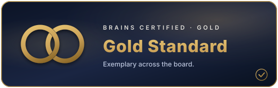

<!-- markdownlint-disable-file MD041 MD001 -->
<div align="center">

<picture>
  <source media="(prefers-color-scheme: dark)" srcset="https://raw.githubusercontent.com/BRAINS-Certified/.github/main/profile/brand-mark-dark-bg.png">
  
</picture>

# BRAINS A11Y

### Accessibility preferences that actually move the page

<br />

[](CHANGELOG.md)
[](ROADMAP.md)
[](https://github.com/BRAINS-Certified/BRAINS-template-repo)
[](LICENSE)
[](docs/CHECKLIST.md)
[](package.json)
[](https://discord.gg/BEmTXXscBr)
[](https://bsky.app/profile/brainscertified.com)

<br />

<a href="https://github.com/BRAINS-Certified/BRAINS-template-repo" title="Meets the BRAINS standard floor"></a>

<br />
<br />

[The axes ↓](#the-eleven-axes) &nbsp;·&nbsp; [Install ↓](#install) &nbsp;·&nbsp; [Evidence ↓](docs/EVIDENCE.md) &nbsp;·&nbsp; [Checklist ↓](docs/CHECKLIST.md) &nbsp;·&nbsp; [Roadmap ↓](ROADMAP.md)

</div>

---

**Eleven viewing preferences. One shared build. Set a page up once, and every other page of ours has the same controls, in the same place, working the same way.**

> **Reliable, affirming, inclusive.** Built by neurodivergent minds, for neurodivergent people.

Zero dependencies. No build step required. Works in React, in Astro, and on a static HTML page with no toolchain at all.

---

## This is not an overlay

An overlay is a widget you bolt on. It promises to make a site compliant. It does not. Disabled users have said so for years, and hundreds of experts have signed their names to that view. Some of these products have been sued.

**BRAINS A11Y** is the opposite. Here is the difference:

| An overlay | This |
|---|---|
| Bolts onto a finished page and tries to correct it from outside | Is part of the design system, so the page is built right |
| Claims conformance | Claims nothing; publishes measurements |
| Hides the page's problems | **Exposes them** — turn text to 200% and every fixed width in your layout shows up |
| Ships a compliance badge | Ships a contrast script that fails your build |

**We ship no compliance badge, and we never will.** A badge that claims what it has not measured is the same problem in a new coat.

---

## Not only for vision

To most people, the wheelchair-style access icon means physical or visual disability. But most of these axes are about **reading, focus and sensory load**. So the button uses the **infinity loop** by default. That is the symbol the neurodivergent community chose for itself. The button also reads **"Display & reading"**, not "Accessibility".

That second choice matters. Many people these controls help do not think of themselves as disabled. They will not open a menu that says they are. Someone who loses their place on long lines is looking for reading settings.

**Puzzle-piece imagery is banned in BRAINS copy and will never appear here.**

Twenty-four icons ship in one family. Six suit the button: `neurodiversity`, `accessibility`, `focus`, `sensory`, and the `brains` and `shard` marks. Pick the one that fits your site.

---

## The eleven axes

Each one defaults to your normal look. So a page is always right: with no saved setting, with storage blocked, or before the script runs.

| | Axis | Values |
|---|---|---|
| ◐ | **Theme** | Midnight · Bone — unset follows the OS |
| ◆ | **Accent** | Gold · Teal · Blue |
| ◑ | **Contrast** | Default · High · **Soft** |
| ▤ | **Density** | Comfortable · Compact |
| **A** | **Text size** | 87.5% · 100% · 125% · 160% · **200%** |
| ≡ | **Line spacing** | Tight · Standard · Roomy |
| ⇔ | **Letter spacing** | Standard · Wide |
| ⟷ | **Line length** | Standard · Narrow |
| **Aa** | **Reading font** | Standard · Atkinson Hyperlegible |
| ◌ | **Motion** | Full · Reduced |
| ▣ | **Decorative images** | Shown · Hidden |

The panel groups them as **Reading**, **Focus & calm**, and **Colour & contrast**. Three headings that show at a glance this is not just a vision tool.

Three things there are unusual enough to call out.

**Contrast has three settings, not two.** High contrast helps some readers and hurts others. Light sensitivity, migraine and sensory needs often call for *less* brightness, not more. Offering only "high" assumes everyone needs the same thing. **Soft** goes the other way.

**Text size reaches 200%.** That is the level WCAG SC 1.4.4 asks for, not a token maximum. Browser zoom adds to it, so a reader who needs 400% can get there. Expect this to find layout bugs. That is the point.

**Density is one scalar,** not a list of utility-class overrides. Add a new spacing value and it follows automatically.

### Beta channel

Enable with `?a11y-beta`, `setExperimental(true)`, or `localStorage['brains.a11y.experimental'] = '1'`.

**Reading guide** (ruler, focus) · **Paper tint** (warm, cool) · **OpenDyslexic**

These are in beta because the evidence is unsettled. [`docs/EVIDENCE.md`](docs/EVIDENCE.md) says so plainly. OpenDyslexic is here because readers ask for it. Studies do not show it helps reading more than a well-set sans-serif. Liking a typeface is reason enough to offer it. It is not reason enough to call it a cure.

---

## Install

```bash
npm install github:BRAINS-Certified/BRAINS-A11Y
```

```jsx
import { noFlashScript } from '@brains/a11y/core/no-flash';
import { A11yProvider, A11yPanel, A11yTrigger, SkipLink } from '@brains/a11y/react';
import '@brains/a11y/tokens/base.css';
import '@brains/a11y/tokens/shard.css';   // or brains.css, or your own
import '@brains/a11y/tokens/panel.css';
import '@brains/a11y/tokens/trigger.css';
```

**Inline the no-flash script in `<head>`.** Loading it from a file reintroduces the flash it exists to prevent.

Recipes for Next.js, Astro and plain HTML: [`docs/MIGRATION.md`](docs/MIGRATION.md). Trigger presets and every tuneable property: [`docs/CONFIGURING.md`](docs/CONFIGURING.md).

---

## Bring your own brand

`tokens/base.css` is behaviour and carries no colour. Add exactly one brand file — two ship here, and a third is a copy away.

| | Shard | BRAINS |
|---|---|---|
| Display | Lexend | Inter |
| Body | DM Sans | **Atkinson Hyperlegible** |
| Mono | DM Mono | JetBrains Mono |
| Dark ground | `#0A1628` | `#0A0A0A` |
| Light ground | `#F5EDD8` | `#FFFFFF` |
| Accent, dark / light | `#FCC14D` / `#7A5500` | `#FCC14D` / `#7A5500` |

BRAINS uses Atkinson Hyperlegible as the **default** body face. The clearest face should not be one a reader has to hunt for.

---

## Verify

```bash
npm run verify        # contrast + unit tests + build — no dependencies, runs in CI
npm run test:browser  # every axis, every value, both brands, in real Chromium
```

`scripts/check-contrast.mjs` measures **60 colour pairs** and fails the build on any miss.

It exists because our own brand guide told us, in three places, to use a gold it said gave "4.6:1, AA" on white. It measures **2.54:1**. It fails. And it failed inside the rule that guide called the most common accessibility bug. [`docs/CONTRAST.md`](docs/CONTRAST.md) tells the whole story. **A ratio in a document is a claim. The script is the proof.**

`test/browser` clicks every value of every axis, in both brands, and checks the page really changed. It exists because three axes once shipped **doing nothing at all**. Each set its attribute. Each reported the right state. None moved the page. Checking attributes passed all three.

---

## What's in the box

```text
core/      vanilla ES modules, zero dependencies — state, no-flash, keyboard, icons, reading guide
tokens/    base.css (behaviour) · shard.css · brains.css · panel.css · trigger.css
react/     A11yProvider · useA11y · A11yPanel · A11yTrigger · A11yMark · Icon · SkipLink
astro/     NoFlash · A11yPanel · A11yTrigger — no client framework
assets/    19 icons, one geometric family, plus a sprite
dist/      brains-a11y.js — IIFE global, for pages with no build step
docs/      SPEC · EVIDENCE · CONTRAST · CHECKLIST · MIGRATION · CONFIGURING
```

---

## Compliance

A site meets the bar when four things are true. The no-flash script is inline. `base.css` and one brand file are loaded. **The panel is in the header on every page, sign-in and error pages included.** And a skip link is the first thing you can tab to.

We build to **WCAG 2.2 AA**. SC 1.4.4, 1.4.10, 1.4.12, 2.3.3, 2.5.8 and the ARIA radio-group pattern are each built in on purpose. **EN 301 549** is the standard behind the European Accessibility Act. Mapping to it is on the [roadmap](ROADMAP.md). It is not done.

[`docs/CHECKLIST.md`](docs/CHECKLIST.md) checks the package against
[The A11Y Project checklist](https://www.a11yproject.com/checklist/), item by item. It sorts each one into
what the package owns, what it helps with, and what stays yours. That audit found **five real defects**.
Control borders at 1.08:1. A selected state shown by colour alone. Four buttons that shared the name
"Standard". A link with no underline. A fixed heading level. All fixed, and all listed.

Using this package does not make a site compliant. We will not say it does. We say what we have measured, and
nothing more.

---

<div align="center">

**[BRAINS](https://github.com/BRAINS-Certified)** · MIT · Contributions welcome — start with [CONTRIBUTING.md](CONTRIBUTING.md)

</div>
